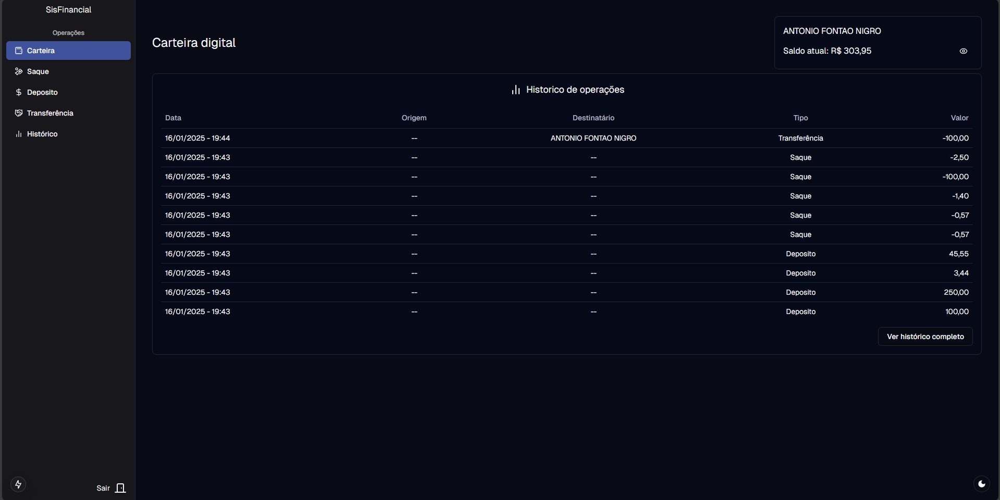
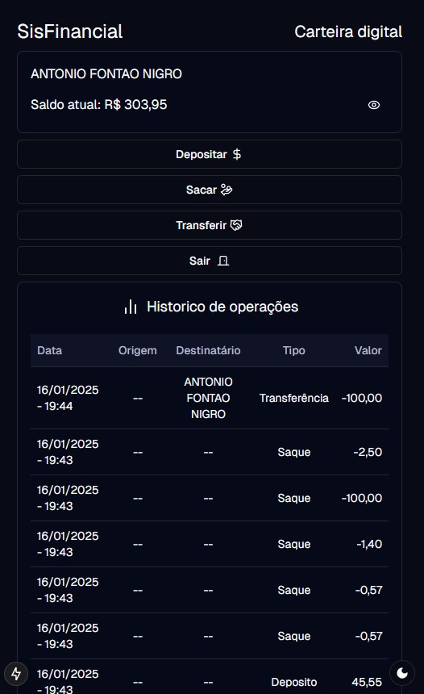

# SisFinancial

  
  

### Requisitos

#### Modulo de autenticação

- 1 - Login [x] [x]
- 2 - Signin [x] [x]

#### Modulo transações bancárias

- 3 - Base autenticada -> Carteira pessoal [x] [x]
- 4 - Deposito [x] [x]
- 5 - Saque [x] [x]
- 6 - transferência [x] [x]
- 7 - reverter operações [x] [x]

O sistema é capaz de criar usuarios, permite deposito e saque da carteira, transferência entre usuarios e reversão de operações assim como apresenta o historico de operações realizadas.
Para as validações esta sendo usado React-hook-form com schemas/validadores do ZOD, para dados compartilhados esta sendo usado Zustand criando stores que são consumidas por hooks, ja para a estilização usamos TailwindCSS com a biblioteca shaduf, a qual é uma biblioteca de componentes diferentes, ela instala os componentes no projeto, dando total liberdade para customizações.
Para mostrar modais foi criado uma hook useURLStates, que utiliza a hook setSearchParams, assim é possível controlar o estado do modal através da URL, também permitindo enviar um link para o usuario caso o mesmo não esteja encontrado certa funcionalidade

## Deploy

O deploy inicial esta sendo feito através da vercel, foi automatizado com a integração github - vercel, assim utilizando gitflow quando é feito o pull request para a branch main (produção) é feito o deploy automático para o seguinte link [SisFinancial](https://sis-financial.vercel.app/app)

## Metodologia de Desenvolvimento

O projeto foi separado em módulos como descrito acima, primeiro esta sendo feito toda a parte visual e as validações locais do frontend, assim que o mesmo estiver completo, sera feito a API NEXTJS, e por fim a integração.

Esta sendo usado gitflow para o processo de desenvolvimento, assim é possível identificar cada commit/branch/pullrequest e o correlacionar a funcionalidade facilmente seguindo o seguinte modelo.

PREFIXO/NUMERO_MODULO-FUNCIONALIDADE_DESENVOLVIDA

lista de prefixos:

- fix: correções no sistema
- feat: inclusão de nova funcionalidade
- config: configurações de ambiente/build/deploy
- docs: alteração na documentação do projeto

Conforme o andamento do desenvolvimento esta documentação é atualizada e é feito o checkmark nos módulos que estão finalizados, assim, a primeira caixa simboliza a parte visual e a segunda a integração com a API NEXTJS.

Entrando mais a fundo no gitflow, a branch default é a develop, nossa branch de desenvolvimento, criamos novas branchs a partir dela com o sistema mencionado acima, e ao finalizar uma implementação é feito um pull request de volta para a develop, quando as implementações de X módulo estiverem concluídas é feito um pull request da develop para a branch release, esta branch é a branch de testes, ela deveria deployar o código para um ambiente de testes (o qual não foi configurado devido a deadline do projeto), caso todos os testes nesse ambiente sejam bem sucedido é feito o pull request da release para a branch main, onde a integração do git-vercel faz o deploy automaticamente para o ambiente de produção configurado na vercel, segue um diagrama para exemplificar este processo

## Rotas

As rotas da api são as seguintes

/api/auth/signup

Recebe body:

    accountType: AccountTypeEnum
    cpf:string
    cnpj:string
    companyName:string
    name:string
    email:string
    password: string
    confirmPassword:string

/api/auth/logout

/api/balance

Recebe parâmetro:

    userId: string

/api/company

Recebe parâmetro:

    cnpj: string

/api/deposit

Recebe body:

    amount: string
    userId: string

/api/history

Recebe parâmetro:

    userId: string

Recebe query:

    page: string
    pageSize: string

/api/history/revert

Recebe parâmetro:

    userId: string
    transactionId: string

/api/person

Recebe parâmetro:

    cpf: string

/api/transference

Recebe parâmetro:

    userId: string
    receiverId: string

Recebe body:

    amount: string
    userId: string
    balance: string
    accountType?: AccountTypeEnum
    cpf?: string
    cnpj?: string

/api/withdraw

Recebe body:

    amount: string;
    userId: string;
    balance: string;

## Banco de dados

Foi utilizado um banco de dados postgres rodando em docker e utilizando prisma como ORM para operar o banco.
